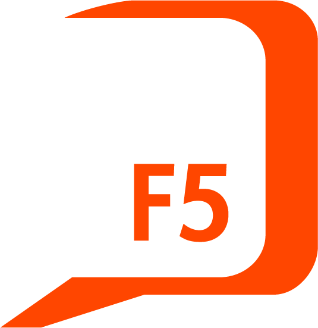
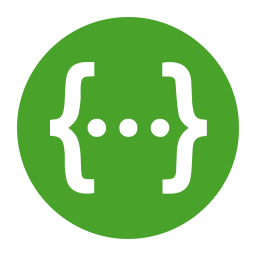

# Coders a bordo - Factoría F5
 

 

***
## Table of Contents
- [Coders a bordo - Factoría F5](#coders-a-bordo---factoría-f5)
  - [Table of Contents](#table-of-contents)
  - [General Information](#general-information)
  - [Screenshots](#screenshots)
  - [Technologies](#technologies)
    - [Backend Technologies](#backend-technologies)
    - [Frontend Technologies](#frontend-technologies)
  - [Installation](#installation)
    - [Backend Installation](#backend-installation)
    - [Frontend Installation](#frontend-installation)
  - [Versions](#versions)
    - [Plugins](#plugins)
  - [Deployment](#deployment)
  - [Authors](#authors)
  - [FAQs](#faqs)
  - [About the project](#about-the-project)
  - [Tools](#tools)
  - [Methodology](#methodology)
***
## General Information
"Coders a bordo” is a web app/game for mobile devices to help new coders in Factoría F5 revise and remember important information that is relevant while doing a bootcamp and once it is finished. 

***

## Screenshots

<tab>
<tr>
<td></td>
<td></td>
<td></td>
<td></td>
</tr>
<tr>
<td></td>
<td></td>
<td></td>
<td></td>
</tr>
<tr>
<td></td>
<td></td>
<td></td>
<td></td>
</tr>
<tr>
<td></td>
<td></td>

***

## Technologies

The project was developed with the following technologies

### Backend Technologies

- NestJS
- Typescript
- NodeJS
- MongoDB
- Swagger
- Jest

 

### Frontend Technologies

- Html
- Css
- React
- Vite
- Typescript 
- NodeJS
- Styled Components
- Axios
- React-Router-DOM
- Jest
- Vitest

***

## Installation

### Backend Installation

To install and run the backend of Coders a bordo, please follow the steps below:

1- Ensure that you have NestJS 9.0.0 or higher and NodeJS installed on your machine.

2- Clone the [repository from GitHub](https://github.com/stranger-strings-team/back-codersabordo).

3- Navigate to the root directory of the project in your terminal.

4- Run `npm install` to install all the necessary dependencies.

5- Copy the .env.example file to a new file named .env, and update the configuration variables as needed.

6- To start the development server, use the command `npm run dev`. This will start a local development server on http://localhost:4000/.

7- To build the project for production, use the command `npm run build`. To deploy you can use a cloud hosting platform like Railway to host your application.

### Frontend Installation

To install and run the frontend of Coders a bordo, please follow the steps below:

1- Ensure that you have Node.js installed on your machine. You can download it from the [official website](https://nodejs.org/en/download/).
2- Clone the [repository from GitHub](https://github.com/stranger-strings-team/front-codersabordo0).
3- Navigate to the root directory of the project in your terminal.
4- Run `npm install` to install all the necessary dependencies.
5- To run the development server, use the command `npm run dev`. This will start a local development server on http://localhost:3000/.
6- To build the project for production, use the command `npm run build`. This will create a **dist** directory with the compiled code.
7- To preview the production build, use the command `npm run preview`.

***
## Versions

- Node.js: v14.16.1
- Npm: 6.14.12
- React: 18.2.0
- NestJS: 9.0.0

***
## Deployment

  
[Visit our link](https://front-codersabordo-production.up.railway.app/)

***

## Authors

[Arnau Mínguez](https://github.com/GrimMori)     
[Hel Aige](https://github.com/HelAige)   
[Rosie Bradshaw](https://github.com/Rosie-Bradshaw)  
[Sablina Angulo](https://github.com/sablinali) 
[Sergi Alsina](https://github.com/SergiAlsina)

***

## About the project

This project was developed as the final presentation of the P6.2022-23 class of the Full Stack bootcamp at Factoria F5.

## Tools

- Figma
- GitHub
- Visual Studio Code

## Methodology

* Agile and SCRUM
* Pair programming
* Kanban
